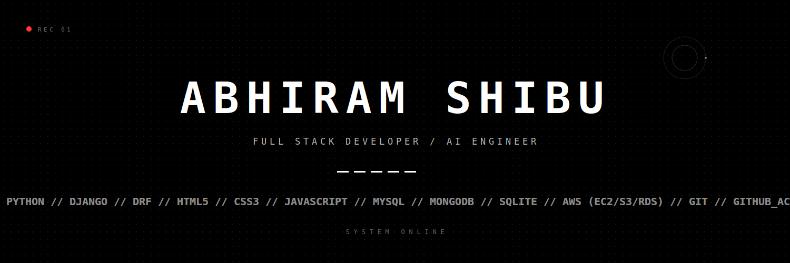

  

 

  <code>SYS.STATUS: ACTIVE</code> • <code>LOC: INDIA</code> • <code>BUILD: 2026</code>

 

### // SYSTEM_OVERVIEW

Engineer focused on functional output and high-performance backend architectures. Specializing in real-time processing, Agent-First APIs, and scalable relational databases. 

**[ CORE_PARAMETERS ]**
* **Architecture:** Multi-vendor routing, real-time performance engineering.
* **AI/Vision:** Agentic workflows, computer vision (OpenCV/YOLOv3).
* **Database:** Relational modeling, complex schema optimization.

---

### // ACTIVE_MODULES (PROJECTS)

#### [01] CLIQ_MART
> **TYPE:** Multi-Vendor eCommerce Platform
> **STACK:** Django // MySQL
> **SPECS:** Comprehensive platform featuring strictly isolated modules for admin, seller, and customer functions. Engineered for secure, high-concurrency order processing.

#### [02] VOICE_GUIDED_VISION
> **TYPE:** Real-Time Object Detection System
> **STACK:** Python // OpenCV // YOLOv3
> **SPECS:** Computer vision module providing real-time audio feedback for dynamic environment mapping and object identification.

#### [03] SIRCAKE
> **TYPE:** Vendor Management & Routing
> **STACK:** Django // MySQL
> **SPECS:** Specialized order routing architecture built for multi-seller environments, featuring live status tracking and complex vendor inventory sync.

#### [04] DRESS_CONFIGURATOR
> **TYPE:** Dynamic Customization Engine
> **STACK:** Django // MySQL // JS
> **SPECS:** Interactive web application handling complex matrix logic for dynamic product configuration with multiple interactive selection variables.

---

### // NETWORK_CONNECTIONS

* **GITHUB_NODE:** [github.com/Abhiram918](https://github.com/Abhiram918)
* **PORT_01 (EMAIL):** [INITIATE_HANDSHAKE](mailto:abhiramshibu918.com)

 

  <code>[ EOF // SYSTEM_STANDBY ]</code>

