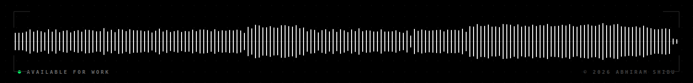

  

 

### About Me

I am a Full Stack Developer and AI Engineer based in India, specializing in high-performance backend architectures, real-time processing, and scalable relational databases. I focus on writing clean, functional code and building data-driven applications.

---

### Skills

**[ LANGUAGES_&_FRAMEWORKS ]** 

 

**[ DATABASES ]** 

 

**[ AI_&_VISION ]** 

 

**[ INFRASTRUCTURE_&_TOOLS ]** 

---

### Contact

  

  

